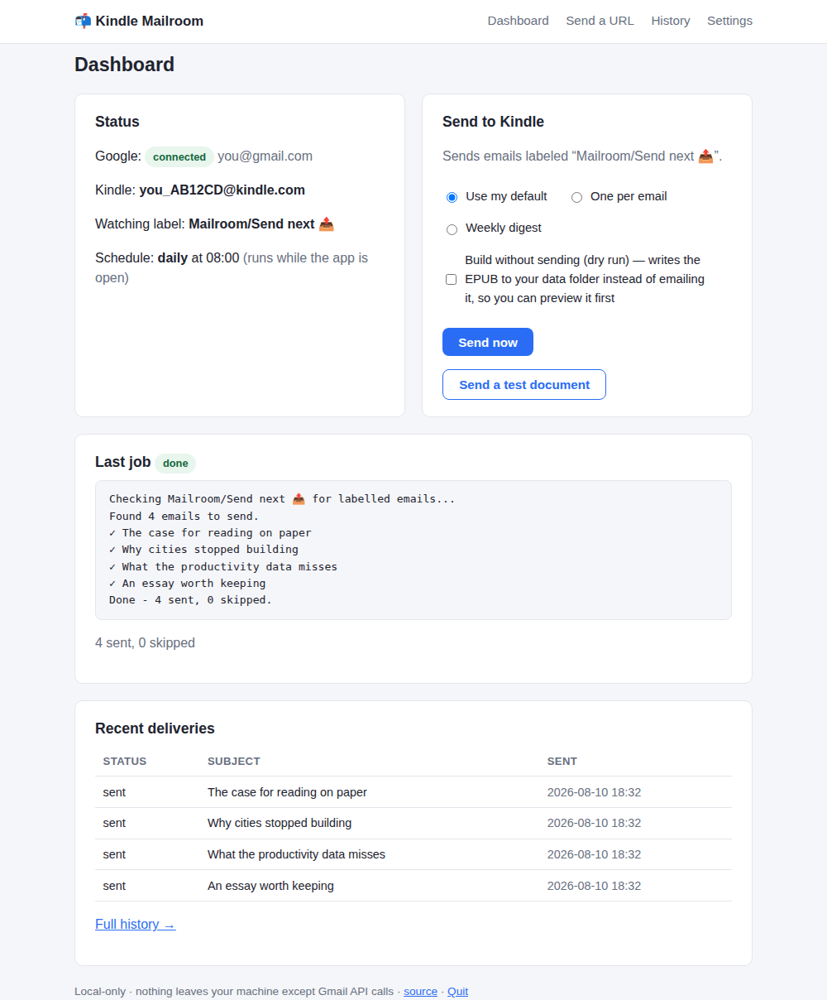
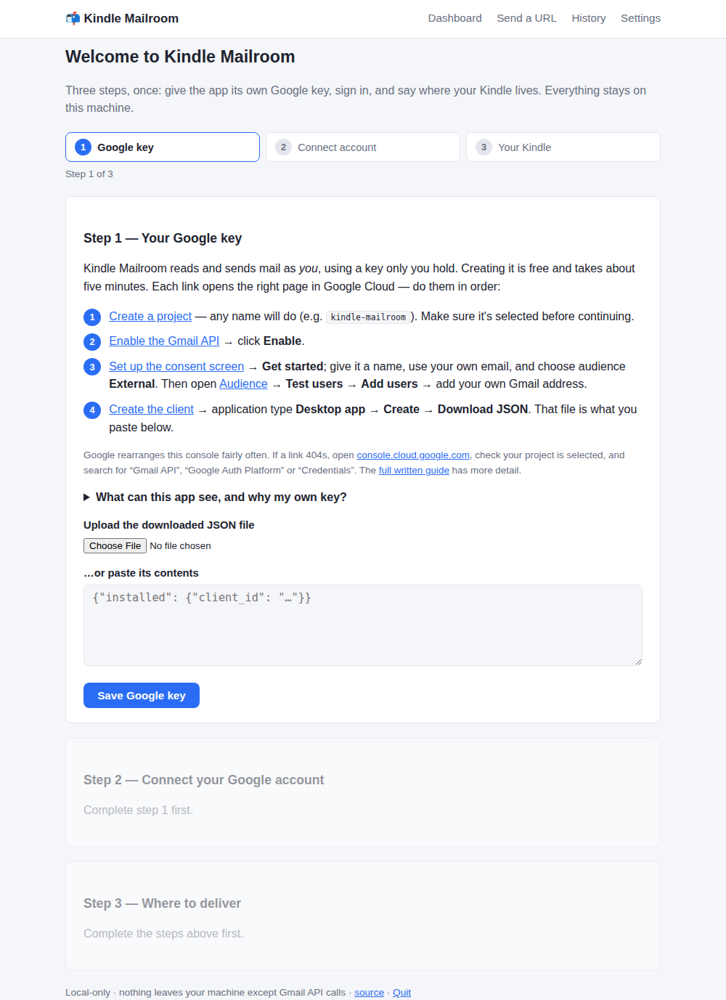
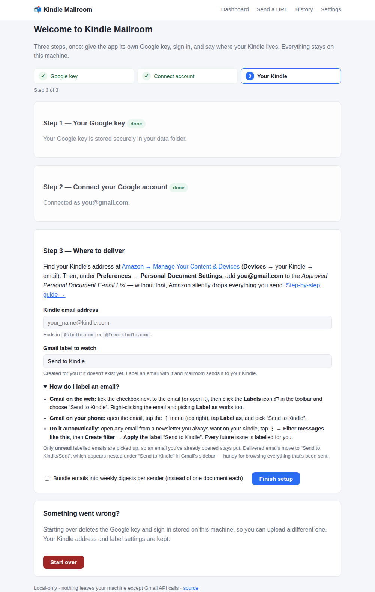

# 📬 Kindle Mailroom

[](https://github.com/cipshadow/mailroom/actions/workflows/ci.yml)

Send your Gmail newsletters — and any web article — to your Kindle as clean,
readable EPUBs. Label an email in Gmail, and it shows up on your Kindle.
Runs entirely on your own machine: no server, no account, no middleman.



## Features

- **Gmail → Kindle**: label any email (default label: `Mailroom/Send next 📤`) and
  Kindle Mailroom converts it to a clean EPUB — strips ads, tracking pixels,
  and layout cruft, sizes images the way the sender intended — and emails it
  to your Kindle.
- **Digest mode**: bundle a week's worth of emails from the same sender into
  one document with a table of contents, instead of one file per email.
- **URL → Kindle**: paste any article link and get the same clean-EPUB
  treatment, no email required.
- **Delivery history**: see what's been sent, restore items for resending.
- **Scheduling**: automatic daily/weekly sends, or hook into your OS
  scheduler for fully unattended delivery.
- **Local web UI**: a setup wizard and dashboard in your browser — no config
  files to hand-edit.

## Quickstart

### Download the app (macOS or Windows — no Python needed)

1. Grab the latest build for your OS from
   [Releases](https://github.com/cipshadow/mailroom/releases/latest) and
   double-click it.
2. It isn't signed with a paid developer certificate (certificates cost
   money; this is a free, open-source project — see
   [docs/install-desktop.md](docs/install-desktop.md#why-unsigned)), so your
   OS will warn you the first time. This is normal:
   - **macOS:** open it once, then go to **System Settings → Privacy &
     Security** and click **Open Anyway**.
   - **Windows:** click **More info**, then **Run anyway** on the SmartScreen
     prompt.
3. Your browser opens straight to the setup wizard below.

See [docs/install-desktop.md](docs/install-desktop.md) for where your data
and logs live, how to quit, and why there's no auto-update.

### Or: the command line (all platforms, including Linux)

Requires **Python 3.10 or newer**.

```bash
pipx install git+https://github.com/cipshadow/mailroom
kindle-mailroom
```

<details>
<summary>No pipx? Use pip, or install from a clone</summary>

```bash
pip install git+https://github.com/cipshadow/mailroom
# …or, to hack on it:
git clone https://github.com/cipshadow/mailroom
cd mailroom && pip install -e ".[dev]"
```
</details>

Either way, `kindle-mailroom` with no arguments starts the local web app and
opens your browser to the setup wizard.



It walks you through two one-time things:

1. **A Google key of your own** (~5 minutes; every step is a direct link into
   the Google Cloud console — see [docs/google-cloud-setup.md](docs/google-cloud-setup.md)).
   There's no server behind this app, so there's no shared key it could use;
   your own OAuth client means only you can authorise access to your mail.
2. **Your Kindle's email address**, plus adding your Gmail address to Amazon's
   approved sender list (see [docs/amazon-kindle-setup.md](docs/amazon-kindle-setup.md)) —
   without that, Amazon silently drops everything.

## Daily use

Label an email `Mailroom/Send next 📤` in Gmail, press **Send now**, and it
lands on your Kindle within a few minutes. The wizard shows you how to apply a
label on web and mobile, and how to have Gmail label a newsletter automatically.



- Every labelled email is sent, read or unread — the label is the signal.
  (Prefer skipping already-opened mail? Turn on unread-only in **Settings**.)
- Delivered emails move to `Mailroom/Sent ✅`, right next to the watched label
  under the `Mailroom` heading in Gmail's sidebar — so `Send next` always shows
  exactly what's still queued, and `Sent` is your delivery archive.
- **Web articles**: go to **Send a URL**, paste one or more links (one per line).
- **Automatically**: turn on a schedule in **Settings**, or see
  [docs/scheduling.md](docs/scheduling.md) for cron/launchd/Task Scheduler.

## Command line

The web app is the friendly path, but everything works headlessly too — this is
what you point cron or launchd at.

| Command | What it does |
|---|---|
| `kindle-mailroom` | Start the web app (same as `web`) |
| `kindle-mailroom web [--port N] [--no-browser]` | Start the web app explicitly |
| `kindle-mailroom send` | Send labelled emails now, using your saved settings |
| `kindle-mailroom send --digest` / `--no-digest` | Override digest mode for one run |
| `kindle-mailroom send --limit N --dry-run` | Cap how many (0 = all), or build without sending |
| `kindle-mailroom send --resend --include-read` | Re-send delivered mail / include read mail |
| `kindle-mailroom send-url URL... [-n] [-c]` | Send article URLs (number them, sort by date) |
| `kindle-mailroom list` | Show delivery history |
| `kindle-mailroom restore` | Move sent emails back to the watched label |
| `kindle-mailroom mark-read MESSAGE_ID` | Mark one delivery as read |
| `kindle-mailroom --version` | Print the version |

## FAQ / Troubleshooting

**My OS says the desktop app is from an "unknown publisher."** Expected —
it isn't signed with a paid developer certificate. See
[docs/install-desktop.md](docs/install-desktop.md) for the one-time steps
to open it anyway, and why it's unsigned.

**How do I quit the desktop app?** There's a **Quit** link in the footer of
every page — it has no terminal to `Ctrl+C`.

**Google shows an "unverified app" warning.** Expected — it's your own app,
just not submitted for Google's public review. Click Continue.

**A document never arrived.** Check that your Gmail address is on Amazon's
*Approved Personal Document E-mail List* (see the Amazon setup doc), and
check your Kindle address is correct on the Settings page.

**"invalid_grant" or "reconnect required."** Google expires OAuth tokens for
apps in testing mode after 7 days of inactivity. Go to **Settings → Reconnect
Google account** — takes a few seconds.

**I'm stuck in the setup wizard.** Use **Start over** at the bottom of the
wizard: it deletes the stored Google key and sign-in so you can upload a
different one, keeping your Kindle address and label settings.

**Amazon rejected the file with an E999 error.** This shouldn't happen —
Kindle Mailroom specifically sanitizes HTML to avoid the empty-tag issue
that causes it. If you hit one anyway, please open an issue with the
newsletter's sender.

**An email was skipped.** Emails under ~200 words are treated as too thin to be
worth a Kindle document. They're moved to your sent label (and out of the
inbox) without being delivered, so they don't get picked up again.

**Where is my data stored?** Not in this repo — everything lives in your OS
user-data directory, whose path is shown on the Settings page. See
[SECURITY.md](SECURITY.md).

## Contributing

Issues and PRs welcome — see [CONTRIBUTING.md](CONTRIBUTING.md). Changes are
listed in [CHANGELOG.md](CHANGELOG.md).

## License

[MIT](LICENSE)
